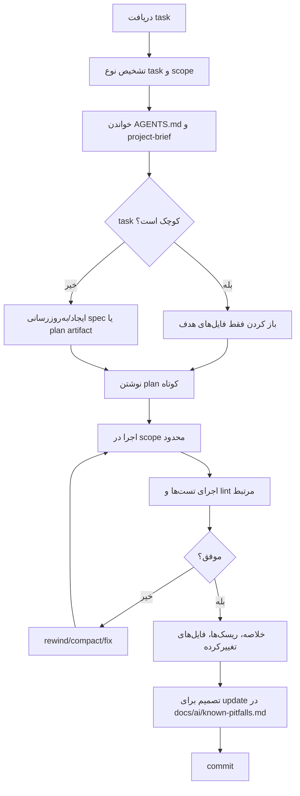

# راهکارهای عملی برای استفادهٔ بهینه از مدل‌های Agent محور در پروژه‌های نرم‌افزاری

## خلاصهٔ اجرایی

برای بهبود هم‌زمان **کیفیت خروجی، تکرارپذیری، امنیت، و هزینهٔ توکن** در ابزارهای Agent محور مثل **Claude Code** و **Google Antigravity**، مهم‌ترین اصل این است که پروژه را به‌جای «چت‌محور»، **اسنادمحور و کانتکست‌مهندسی‌شده** طراحی کنید. در Claude، فایل `CLAUDE.md` و حافظهٔ محلی پروژه در ابتدای هر جلسه بارگذاری می‌شوند؛ Anthropic صراحتاً می‌گوید هرچه این دستورها **مشخص‌تر و مختصرتر** باشند، تبعیت مدل سازگارتر می‌شود. در Antigravity نیز معماری رسمی بیشتر بر **Projects، Rules، Skills، Artifacts، و اسناد project-context/spec** تکیه دارد، نه بر یک فایل واحد شبیه `AGENTS.md`. بنابراین، برای تیم‌هایی که می‌خواهند بین ابزارها جابه‌جا شوند، بهترین طراحی، یک لایهٔ **vendor-neutral** مانند `AGENTS.md` در کنار نگاشت آن به فایل‌ها و قابلیت‌های بومی هر پلتفرم است. citeturn19search0turn8view0turn5search1turn5search2turn3view3turn3view4

از نظر مصرف توکن، شواهد رسمی و پژوهشی روی یک نکتهٔ مشترک همگرا هستند: **کانتکست بیشتر لزوماً بهتر نیست**. Anthropic در مستندات context window تصریح می‌کند که با بزرگ‌شدن کانتکست، بازیابی و دقت افت می‌کند و پدیدهٔ «context rot» رخ می‌دهد. پژوهش‌های جدید نیز نشان می‌دهند که فشرده‌سازی فعال، انتخاب دقیق بخش‌های قابل بازیابی، و اجتناب از دستورها و فایل‌های متورم، هم هزینه را پایین می‌آورد و هم کیفیت را حفظ یا حتی بهتر می‌کند. در یک نمونهٔ پژوهشی، فشرده‌سازی فعال در یک عامل نرم‌افزاری به **کاهش 22.7٪ توکن** بدون افت دقت انجامیده است، و در پژوهش دیگری بازپخش هوشمند مسیرهای میانی در عامل‌های SWE هزینه را تا **17.4٪** کاهش داده و در برخی تنظیمات عملکرد را هم بهبود داده است. citeturn8view2turn11view4turn12view0turn11view3

اگر بخواهم توصیه‌ها را به یک نسخهٔ اجرایی کوتاه کاهش دهم، این چهار تصمیم بیشترین بازده را دارند: نخست، **یک منبع حقیقت کوتاه و پایدار** برای پروژه بسازید؛ دوم، **هر task را باریک و فایل‌محور** تعریف کنید؛ سوم، **از ابزارها و ارجاع فایل استفاده کنید، نه paste انبوه**؛ و چهارم، **جلسه‌ها را دوره‌ای compact/clear/restart** کنید تا conversation history به زباله‌دان کانتکست تبدیل نشود. در Claude، prompt caching، subagents، `/compact`، `/clear`، و ازسرگیری sessionها برای این کارها مستقیماً پشتیبانی می‌شوند. در Antigravity نیز Projects با scope محدود، Rules و Skills کوتاه، Artifacts قابل بازبینی، و Spec-Driven Development همین هدف را دنبال می‌کنند. citeturn8view1turn8view3turn21search4turn21search0turn19search1turn3view3turn16search1turn20search8turn20search11

## معماری پیشنهادی فایل‌ها و منبع حقیقت

پیشنهاد عملی این گزارش این است که بین «فایل راهنمای پایدار»، «اسناد توضیحی»، و «حافظهٔ متغیر» تمایز روشن بگذارید. برای Claude، فایل رسمی و بومی `CLAUDE.md` است. طبق مستندات رسمی، `CLAUDE.md` در شروع گفتگو بارگذاری می‌شود، می‌تواند با `@path/to/import` فایل‌های دیگر را وارد کند، و واردسازی تا **چهار پرش** به‌صورت بازگشتی پشتیبانی می‌شود. همچنین Anthropic می‌گوید `CLAUDE.md` **به‌طور کامل** بارگذاری می‌شود، هرچند فایل‌های کوتاه‌تر تبعیت بهتری ایجاد می‌کنند. در مقابل، `MEMORY.md` فقط تا **200 خط نخست یا 25KB** در شروع هر جلسه بارگذاری می‌شود و بقیهٔ یادداشت‌ها باید در topic fileها بمانند. citeturn1search0turn8view0turn19search0

در Antigravity، هم‌ارز بومی `CLAUDE.md` بیشتر مجموعه‌ای از **Rules + Skills + Project Context/Constitution + Specs** است. مستندات و کدلَب‌های رسمی Antigravity نشان می‌دهند که Ruleها فایل‌های Markdown برای قیدها و guardrailها هستند، Skillها قابلیت‌های بازاستفاده‌پذیر با فایل `SKILL.md` و frontmatter YAML دارند، و در الگوهای مبتنی بر SDD، فایل‌هایی مانند `project-context.md` و `constitution.md` به‌عنوان زمینه و اصول غیرقابل‌مذاکره در planning/analyze استفاده می‌شوند. همچنین Antigravity برای Ruleها محدودیت **12,000 کاراکتر** در هر فایل را مستند کرده است. citeturn5search1turn5search2turn3view3turn18search0

به همین دلیل، اگر بخواهید یک ساختار واقعاً قابل‌حمل بین Claude و Antigravity داشته باشید، بهتر است `AGENTS.md` را **لایهٔ انتزاعی و مشترک** بگذارید و آن را به قابلیت‌های بومی نگاشت کنید: `CLAUDE.md` برای Claude، و در Antigravity نسخه‌ای از همان محتوا در Ruleها/Skillها/Project Context. این توصیه به‌خصوص از آن‌جا مهم می‌شود که پژوهش جدید دربارهٔ فایل‌های `AGENTS.md` و `CLAUDE.md` نشان می‌دهد smellهایی مانند **Context Bloat، Conflicting Instructions، Skill Leakage، و Lint Leakage** بسیار شایع‌اند و مستقیماً به هدررفت کانتکست و افت کیفیت منجر می‌شوند. citeturn11view0turn19search0turn5search1turn5search2

جدول زیر یک طراحی عملی و پیشنهادی را جمع‌بندی می‌کند:

| فایل | نقش | برای کدام ابزار | حد/اندازهٔ پیشنهادی | مبنا |
|---|---|---|---|---|
| `AGENTS.md` | قانون‌های مشترکِ vendor-neutral، نقشهٔ پروژه، خروجی مطلوب | همه | **پیشنهادی:** 80–180 خط؛ فقط قواعد پایدار | پیشنهاد تحلیلی این گزارش، با تکیه بر شواهد مربوط به context bloat و تعارض دستورها citeturn11view0 |
| `CLAUDE.md` | حافظه و دستورهای پروژه‌ای که در شروع جلسه load می‌شوند | Claude | **رسمی:** hard limit اعلام نشده؛ **پیشنهادی:** 5–12KB یا حدود 100–250 خط | `CLAUDE.md` کامل load می‌شود و کوتاه‌ترها adherence بهتری دارند citeturn8view0turn19search0 |
| `docs/ai/project-brief.md` | تصویر کلان معماری، مسیرها، دستورات، قیدهای اصلی | همه | **پیشنهادی:** 80–150 خط | در Antigravity، project-context / spec به‌عنوان SSOT استفاده می‌شود؛ در Claude هم imports و memory on-demand مناسب‌اند citeturn3view3turn1search0turn8view0 |
| `docs/ai/known-pitfalls.md` | خطاهای تکرارشونده، تصمیم‌های معماری، edge caseها | همه | **پیشنهادی:** 30–100 خط؛ فقط آموخته‌های پایدار | auto memory/topic files در Claude و project context در Antigravity این الگو را تقویت می‌کنند citeturn8view0turn3view3 |
| `.agent/rules/*.md` | guardrailهای پایدار و workspace/project specific | Antigravity | **رسمی:** هر Rule تا 12,000 کاراکتر | مستندات رسمی Antigravity citeturn18search0turn5search1 |
| `.agent/skills/<name>/SKILL.md` | workflow/capability بازاستفاده‌پذیر | Antigravity | کوتاه + frontmatter YAML + ارجاع به فایل‌های کمکی | مستندات رسمی و کدلَب Skills citeturn5search2turn3view3 |

برای پروژه‌های **کوچک**، معمولاً `AGENTS.md` + `project-brief.md` کافی است. برای پروژه‌های **متوسط**، `known-pitfalls.md` و بخش commandها و architecture map اهمیت پیدا می‌کند. برای پروژه‌های **بزرگ یا monorepo**، باید از فایل‌های کوتاهِ ورودی و واردسازی تدریجی (`@imports` در Claude، Skills/Rules/Specs در Antigravity) استفاده کرد؛ چون بارگیری کامل فایل‌های بزرگ، دقیقاً همان context saturation و context rot را تشدید می‌کند که مستندات و پژوهش‌ها نسبت به آن هشدار داده‌اند. citeturn8view0turn8view2turn20search1

نمونهٔ کوتاهِ پیشنهادی برای `AGENTS.md`:

```md
# Project Agent Guide

## Goal
این پروژه یک سرویس SaaS برای مدیریت سفارش‌هاست.
هدف هر task: تغییر کوچک، قابل تست، و سازگار با API فعلی.

## Stack
- Backend: FastAPI
- Frontend: React + Vite
- DB: PostgreSQL
- Package manager: uv + pnpm

## Must-read first
- docs/ai/project-brief.md
- docs/ai/known-pitfalls.md

## Commands
- Install: `uv sync && pnpm install`
- Test backend: `uv run pytest -q`
- Test frontend: `pnpm test`
- Lint: `pnpm lint && uv run ruff check .`

## Constraints
- API عمومی را بدون ذکر صریح تغییر نده.
- dependency جدید اضافه نکن مگر ضروری.
- تغییرات را کوچک و مرحله‌ای نگه دار.
- قبل از هر تغییر، فایل‌های مرتبط را بخوان.
- بعد از تغییر، تست مرتبط را اجرا کن.

## Output
- plan کوتاه
- لیست فایل‌های تغییرکرده
- خلاصهٔ تغییرات
- ریسک‌ها و تست‌های اجراشده
```

این نوع قالب با توصیه‌های رسمی Anthropic دربارهٔ **صراحت، ترتیب گام‌ها، نقش‌دهی، و ساختاربندی** سازگار است، و در Antigravity نیز به‌خوبی به Rule/Skill/Spec قابل تبدیل است. citeturn9view0turn3view3turn5search1turn5search2

## الگوهای پرامپت و ارکستراسیون کار

مستندات Anthropic روی چند اصل برای prompt تأکید دارد: **شفاف و مستقیم بودن، ذکر فرمت خروجی، استفاده از مثال، و ساختاربندی صریح با XML tags**. همچنین در کار با کانتکست بلند، توصیه می‌کند داده‌های طولانی بالاتر در prompt قرار گیرند و پرسش/درخواست اصلی پایین‌تر بیاید. این الگو در پروژه‌های نرم‌افزاری به این معناست که prompt باید از «هدف → scope → constraints → files → success criteria» حرکت کند، نه از توصیف مبهم مسئله. citeturn9view0turn9view1

در Claude، بهترین الگو برای task-level prompt معمولاً این است که از مدل بخواهید ابتدا **plan کوتاه** بدهد، سپس فقط فایل‌های مرتبط را بخواند، بعد patch کوچک بزند، و در پایان تست/خلاصه/ریسک را گزارش کند. در Antigravity نیز همین الگو با artifacts و implementation plan طبیعی‌تر می‌شود، چون پلتفرم صراحتاً plan و artifactهای قابل بازبینی تولید می‌کند و حتی در کدلَب‌های رسمی، روی این تأکید می‌شود که **doc یا spec منبع حقیقت** باشد و اگر جهت عوض شد، ابتدا سند اصلاح شود نه کد. citeturn8view4turn23search11turn20search6turn20search8

سه الگوی کامل و پیشنهادی زیر برای استفادهٔ روزمره مناسب‌اند. این‌ها templateهای توصیه‌ای این گزارش‌اند، اما بر الگوهای رسمی prompt design، plan-before-editing، spec-first، و artifact review تکیه دارند. citeturn8view4turn9view0turn13search1turn23search11

### الگوی onboarding

```xml
<task>
یک نقشهٔ دقیق و کوتاه از این repo بساز، بدون هیچ تغییر کدی.
</task>

<context>
ابتدا فقط این فایل‌ها/مسیرها را بخوان:
- AGENTS.md
- CLAUDE.md
- docs/ai/project-brief.md
- README.md
- package.json
- pyproject.toml
</context>

<deliverables>
1. architecture map
2. مسیرهای مهم
3. commandهای setup/test/lint/build
4. ریسک‌های رایج
5. فایل پیشنهادی برای docs/ai/project-brief.md
</deliverables>

<constraints>
- هیچ فایل کدی را تغییر نده
- حداکثر 120 خط خروجی
- اگر اطلاعات کم بود، صریح بگو چه چیزی نامشخص است
</constraints>
```

### الگوی small bugfix

```xml
<task>
باگ اعتبارسنجی login را رفع کن.
</task>

<scope>
فقط این فایل‌ها را بررسی کن مگر این‌که واقعاً لازم شود:
- backend/auth/login.py
- backend/auth/schemas.py
- tests/auth/test_login.py
</scope>

<success_criteria>
- ورودی نامعتبر باید 400 بدهد
- API عمومی تغییر نکند
- تست‌های auth پاس شوند
</success_criteria>

<workflow>
1. اول plan کوتاه بده
2. علت محتمل باگ را توضیح بده
3. فقط تغییرات minimal بده
4. تست‌های مرتبط را اجرا کن
5. خلاصهٔ تغییرات و ریسک‌ها را بنویس
</workflow>
```

### الگوی refactor with tests

```xml
<task>
کد لایهٔ billing را refactor کن تا خواناتر و testableتر شود، بدون تغییر رفتار خارجی.
</task>

<context>
منبع حقیقت:
- docs/ai/project-brief.md
- docs/ai/known-pitfalls.md
- docs/billing-contract.md
</context>

<constraints>
- API عمومی، schema دیتابیس، و event names تغییر نکنند
- dependency جدید اضافه نشود
- refactor غیرمرتبط انجام نشود
</constraints>

<expected_output>
- plan
- فایل‌های هدف
- refactor patch
- تست‌های جدید/اصلاح‌شده
- before/after rationale
</expected_output>

<verification>
- تست billing
- lint
- اگر coverage افت کرد، دلیل را بگو
</verification>
```

برای Antigravity می‌توان همین templateها را تقریباً بدون تغییر استفاده کرد، اما دو سازگاری بومی مفید است: یکی این‌که از **Artifacts/Implementation Plan** به‌عنوان deliverable صریح نام ببرید؛ دوم این‌که به‌جای paste اسناد، به فایل‌های داخل workspace با `@filename` یا path ارجاع دهید. مستندات Antigravity حتی اشاره می‌کنند که انتخاب و درج مسیر فایل مستقیماً به prompt کمک می‌کند جست‌وجوها هدف‌مند شوند، و Ruleها نیز می‌توانند با `@filename` به فایل‌های دیگر اشاره کنند. citeturn20search11turn20search15turn20search0

## تکنیک‌های کاهش توکن و موازنه‌ها

کاهش توکن فقط «کوتاه‌نویسی» نیست؛ در پروژه‌های Agent محور، هدف اصلی این است که **فقط اطلاعاتی وارد کانتکست شوند که برای تصمیم بعدی لازم‌اند**. Anthropic به‌صراحت می‌گوید prompt caching برای prefixهای تکراری هزینه و latency را کم می‌کند، subagentها کارهای فرعی را در context window جداگانه اجرا می‌کنند، و auto-compaction هنگام نزدیک‌شدن به سقف کانتکست، خلاصه‌سازی و حذف خروجی‌های ابزار را انجام می‌دهد. در Antigravity هم هشدار رسمی نسبت به **Tool Bloat** و **Context Saturation** داده شده است. citeturn8view1turn8view3turn21search1turn21search2turn20search1

جدول زیر مهم‌ترین روش‌ها و trade-offهای آن‌ها را جمع‌بندی می‌کند:

| روش | چه کم می‌کند | بهترین کاربرد | trade-off اصلی | شواهد |
|---|---|---|---|---|
| Chunking اسناد و فایل‌ها | ورودی خام و بی‌ربط | repoهای متوسط/بزرگ | اگر تکه‌بندی بد باشد، وابستگی‌های بین‌فایلی گم می‌شود | Anthropic دربارهٔ context rot هشدار می‌دهد؛ RAG/caching پژوهش‌ها نیز بار context را مسئله می‌دانند citeturn8view2turn11view2 |
| Retrieval / file pointers به‌جای paste | توکن ورودی | کد، لاگ، PR، اسناد بزرگ | نیازمند ابزار/دسترسی فایل | Claude و MCP برای پرهیز از copy-paste و Antigravity برای import path/file reference توصیه می‌شوند citeturn15search5turn20search15turn20search0 |
| Stateful session | تکرار دستورهای ثابت | featureهای چندمرحله‌ای | خطر انباشت context و drift | Claude sessionها را می‌توان ادامه داد؛ Antigravity هم conversation history و threadها را حفظ می‌کند citeturn19search1turn19search16turn23search4turn23search0 |
| Stateless session | آلودگی context | reviewهای یک‌باره، bugfixهای کوچک | باید context ضروری را هر بار صریح بدهید | در SDK Claude، هر `query()` به‌طور پیش‌فرض تازه شروع می‌شود مگر resume/continue بدهید citeturn19search16 |
| Prompt caching | هزینه و latency prefixهای ثابت | system prompt، examples، docs ثابت | cache window محدود است؛ برای inputهای بسیار پویا کم‌اثرتر می‌شود | cache پیش‌فرض 5 دقیقه است و برای promptهای تکراری طراحی شده است citeturn8view1 |
| Summarization / compaction | history بلند | sessionهای طولانی | خطر حذف جزئیات مهم | Claude auto-compact و `/compact` دارد؛ پژوهش Focus کاهش 22.7٪ توکن را بدون افت دقت گزارش می‌کند citeturn21search4turn21search2turn12view0 |
| Instruction compression | tokenهای ثابت راهنما | system prompt و guide file | اگر بیش‌ازحد فشرده شود، ابهام بالا می‌رود | Anthropic بر دستورهای مشخص و مختصر تأکید می‌کند؛ smellهای فایل‌های پیکربندی نیز bloat را پرهزینه می‌دانند citeturn9view0turn11view0 |
| Subagents / delegated research | آلودگی context اصلی | جست‌وجوی لاگ، پژوهش، خواندن انبوه فایل | نیازمند orchestration بهتر | هر subagent context window جدا و مجوز مستقل دارد؛ Antigravity نیز subagentهای ایزوله دارد citeturn8view3turn23search8 |

در عمل، ترکیب برنده معمولاً این است: **guide file کوتاه + file pointers + resume فقط برای کار مرتبط + compaction دوره‌ای + subagent برای خواندن‌های سنگین**. این ترکیب هم با توصیه‌های رسمی سازگار است و هم با شواهد پژوهشی جدیدی که نشان می‌دهند بازیابی و فشرده‌سازی فعال، به‌جای هر بار شروع از صفر یا هر بار حمل کل history، بهینه‌تر است. citeturn21search4turn8view3turn11view3turn12view0

## مدیریت context و حافظهٔ پروژه

Claude دو لایهٔ حافظهٔ مکمل دارد: `CLAUDE.md` و auto memory. هر دو در شروع جلسه لود می‌شوند، اما Anthropic روشن می‌کند که این‌ها **context هستند، نه مکانیزم enforcement**؛ اگر به چیزی در حد policy سخت‌گیرانه نیاز دارید، باید از hookها و permissionها استفاده کنید. این تمایز برای تیم‌ها مهم است: `CLAUDE.md` جای «خواهش رفتاری» است، نه «کنترل دسترسی». citeturn19search0turn21search13turn15search12turn21search18

برای garbage collection کانتکست، در Claude بهترین قاعده این است که بین taskهای نامرتبط از `/clear` استفاده شود، و برای taskهای مرتبط اما طولانی از `/compact` با focus directive. مستندات رسمی می‌گویند Claude هنگام نزدیک‌شدن به limit به‌صورت خودکار ابتدا خروجی‌های قدیمی ابزار را پاک می‌کند و سپس conversation را خلاصه می‌کند؛ همچنین اگر جزئیات واقعاً باید پایدار بمانند، باید در `CLAUDE.md` یا حافظهٔ پروژه نوشته شوند، نه این‌که فقط به history چت سپرده شوند. citeturn21search0turn21search4turn21search2turn21search14

در Antigravity، معادل این رویکرد «conversation history + artifact persistence + spec files» است. کدلَب‌های رسمی نشان می‌دهند که specificationها و artifactها به‌عنوان فایل‌های version-controlled نگه داشته می‌شوند، بنابراین اگر گفتگو قطع شود یا بعداً بخواهید به تصمیم‌ها برگردید، اطلاعات در چت دفن نشده‌اند. این دقیقاً همان سیاستی است که برای جلوگیری از اتکای بیش‌ازحد به stateful session توصیه می‌شود: **چیزهای پایدار روی دیسک، چیزهای گذرا در conversation**. citeturn23search17turn20search8turn23search11

یک policy ساده و عملی برای «چه زمانی full context لازم است» می‌تواند چنین باشد: اگر task فقط روی **۱ تا ۳ فایل** و بدون تغییر contract عمومی متمرکز است، full context لازم نیست؛ اگر task روی **معماری، migration، API contract، یا refactor چندماژوله** اثر می‌گذارد، ابتدا `project-brief` و اسناد قرارداد/معماری را وارد کنید؛ و اگر task طولانی و اکتشافی است، از subagent یا skill جداگانه برای مطالعهٔ عمیق استفاده کنید و فقط summary را به context اصلی برگردانید. این یک استنتاج مهندسی از مستندات session/subagent/memory و تجربهٔ مستند‌شدهٔ SDD است. citeturn8view3turn8view4turn19search16turn23search17

برای versioning، بهتر است `AGENTS.md` و `project-brief.md` تحت git باشند، ولی `known-pitfalls.md` فقط زمانی commit شود که یک آموختهٔ **تکرارشونده و غیرمحلی** ثبت می‌شود. اگر هر event کوچک را به این فایل‌ها اضافه کنید، خیلی زود همان smellهای context bloat و conflicting instruction برمی‌گردند. پژوهش smellها دقیقاً نشان می‌دهد که این نوع نشت دستور و تکرار ruleهای خودکارشده، در عمل رایج است. citeturn11view0

## سنجش، امنیت و حریم خصوصی

Anthropic در مستندات ارزیابی تأکید می‌کند که هر بهینه‌سازی prompt یا workflow باید با **success criteria مشخص، قابل اندازه‌گیری، و task-specific** سنجیده شود. به‌طور خاص، معیارهایی مانند task fidelity، consistency، context utilization، latency، price، و privacy preservation به‌عنوان ابعاد متداول ارزیابی معرفی شده‌اند. بنابراین برای پروژه‌های نرم‌افزاری، بهتر است KPIها را هم روی **کیفیت خروجی** و هم روی **هزینه/زمان** ببندید، نه فقط روی یکی از آن‌ها. citeturn22view0

پیشنهاد KPIهای عملی برای تیم مهندسی:

| KPI | تعریف پیشنهادی | روش جمع‌آوری |
|---|---|---|
| Token per successful task | مجموع token ورودی/خروجی تقسیم بر taskهای موفق | لاگ API / telemetry |
| First-pass success rate | درصد taskهایی که بدون prompt دوم به خروجی قابل‌قبول می‌رسند | review checklist |
| Scope escape rate | درصد دفعاتی که agent خارج از فایل‌ها/محدودهٔ خواسته‌شده عمل کرده | diff review |
| Regression rate | درصد taskهایی که بعداً به bug/test failure تبدیل می‌شوند | CI + issue tracking |
| Time-to-reviewable-patch | زمان تا اولین patch قابل review | telemetry IDE/CLI |
| Sensitive exposure incidents | تعداد موارد paste شدن secret/log حساس یا دسترسی فراتر از scope | security logs / DLP |

این KPIها با اصول رسمی Anthropic برای measurable criteria و eval design سازگارند، و از نظر تجربهٔ عملی با عامل‌های کدنویسی از این جهت مهم‌اند که پژوهش‌های جدید بارها نشان داده‌اند benchmarkهای صرفاً آزمایشگاهی می‌توانند عملکرد واقعی را **بیش‌برآورد** کنند؛ بنابراین A/B باید تا حد ممکن به taskهای واقعی شما نزدیک باشد. citeturn22view0turn10search1turn10search16

برای A/B تست، دو بازوی ساده اما ارزشمند وجود دارد: **A = prompt آزاد و بدون اسناد پروژه** در برابر **B = prompt scoped با `AGENTS.md + project-brief + file pointers`**؛ و **A = session کاملاً stateful** در برابر **B = session stateful با compact/clear دوره‌ای و summary روی دیسک**. ارزیابی را بهتر است روی 20 تا 50 task واقعی از سه کلاس bugfix/refactor/feature اجرا کنید و هم‌زمان cost، latency، pass rate، و reviewer score را بسنجید. Anthropic Console نیز ابزار Evaluation برای نسخه‌بندی prompt، مقایسهٔ side-by-side، و grading کیفیت ارائه می‌دهد. citeturn22view1turn22view0

از نظر امنیت و حریم خصوصی، در Claude چند نکتهٔ کلیدی وجود دارد: Zero Data Retention برای برخی قابلیت‌ها و حساب‌های واجد شرایط پشتیبانی می‌شود؛ prompt caching و بسیاری از featureهای Messages/Context Window تحت شرایط ZDR واجد شرایط‌اند؛ اما همهٔ قابلیت‌ها این‌طور نیستند و مثلاً Files API و Message Batches چنین وضعیتی ندارند. همچنین مجوز ابزارها و MCP serverها باید صریح و محدود تعریف شوند، و Anthropic برای Claude Code از ruleهای allow/ask و audit eventهای OpenTelemetry هم پشتیبانی می‌کند. citeturn15search0turn15search1turn15search4turn15search16turn15search12turn15search22turn15search8

در Antigravity نیز اصل **least privilege** بسیار روشن است: پروژه‌ها project-centric هستند، می‌توانند فقط یک یا چند فولدر مشخص را شامل شوند، و هر پروژه تنظیمات و سیاست‌های امنیتی ایزولهٔ خود را دارد. مستندات و اطلاعیه‌های رسمی همچنین از **terminal sandboxing، credential masking، hardened Git policies**، و permission engine ریزدانه سخن می‌گویند. بنابراین توصیهٔ عملی این است که هر task را در کوچک‌ترین Project ممکن اجرا کنید، فولدرهای بی‌ربط را به Project اضافه نکنید، و برای workspaceهای حساس sandbox و ask-for-approval را سخت‌گیرانه‌تر نگه دارید. citeturn3view4turn16search1turn16search2turn16search5turn16search0turn17search1turn17search5

## تمپلیت‌ها و روتین عملی

روتین پیشنهادی برای هر task باید به‌جای تکیه بر حافظهٔ عامل، روی یک چرخهٔ سبک اما منظم بنا شود: **آماده‌سازی کانتکست، plan، اجرا، verification، و نگهداری دانش**. این دیدگاه هم با common workflows در Claude سازگار است و هم با الگوی SSOT/Artifacts در Antigravity. citeturn8view4turn20search6turn23search11



چک‌لیست قبل از task بهتر است فقط چند پرسش داشته باشد: آیا این task واقعاً به full context نیاز دارد؟ آیا منبع حقیقت مشخص است؟ آیا فایل‌ها و commandهای هدف معلوم‌اند؟ آیا امنیت/مجوز/secret درگیر است؟ و آیا خروجی نهایی «code»، «plan»، «review»، یا «doc update» است؟ اگر پاسخ این‌ها روشن نباشد، معمولاً عامل به exploration بی‌هدف و مصرف توکن بیشتر کشیده می‌شود. citeturn9view0turn20search1turn21search0

چک‌لیست بعد از task نیز باید کوتاه اما سخت‌گیر باشد: فقط تست‌های مرتبط اجرا شده‌اند یا نه؛ آیا scope رعایت شده؛ آیا API یا behavior بیرونی ناخودآگاه تغییر کرده؛ آیا چیزی هست که باید در `known-pitfalls.md` یا `project-brief.md` ثبت شود؛ و آیا session باید compact/clear شود یا برای task بعدی ادامه پیدا کند. در Claude، `/compact` و `/clear` ابزارهای بومی همین مرحله‌اند؛ در Antigravity نیز `/rewind`، conversation management، و artifact review برای همین کنترل‌ها مناسب‌اند. citeturn21search4turn21search0turn23search6turn23search12

یک template عملی برای commit message:

```text
<type>(<scope>): <short summary>

Why:
- چرا این تغییر لازم بود

What:
- چه فایل‌ها/رفتارهایی تغییر کرد

Verification:
- چه تست‌ها/چک‌هایی اجرا شد

Risk:
- چه ریسک یا limitation باقی مانده است
```

قاعدهٔ به‌روزرسانی docs هم بهتر است چنین باشد: اگر دانشی **فقط برای همین task** مفید است، وارد چت/summary بماند؛ اگر دانشی **برای taskهای آینده، افراد جدید، یا Agentهای دیگر** نیز احتمالاً مفید است، آن را به `project-brief.md` یا `known-pitfalls.md` منتقل کنید؛ و اگر دانش **الگویی و بازاستفاده‌پذیر** است، آن را به skill/rule/CLAUDE import تبدیل کنید. این همان مرز مهم بین transient state و durable context است که مستندات Claude memory و الگوهای Antigravity SDD عملاً توصیه می‌کنند. citeturn8view0turn21search13turn3view3turn20search6

## منابع کلیدی

- Anthropic, **How Claude remembers your project** و **CLAUDE.md vs auto memory**. برای فهم بارگذاری `CLAUDE.md`، `MEMORY.md`، واردسازی با `@path`، و حدود startup memory. citeturn8view0turn19search0
- Anthropic, **Prompt caching** و **Context windows**. برای caching، مدیریت prefix پایدار، و context rot. citeturn8view1turn8view2
- Anthropic, **Prompting best practices** و **Define success criteria and build evaluations**. برای طراحی prompt، XML tags، examples، و KPI/eval. citeturn9view0turn22view0
- Anthropic, **Create custom subagents** و **Common workflows**. برای plan-before-edit، subagent delegation، و context isolation. citeturn8view3turn8view4
- Google, **Getting Started with Google Antigravity** و **Projects / Settings / Permissions**. برای project boundaries، isolated security settings، و scope control. citeturn3view4turn16search1turn16search2turn16search5
- Google, **Rules / Skills / Artifacts / Spec-Driven Development codelabs**. برای Ruleها، Skillها، project constitution، project-context، و SSOT. citeturn5search1turn5search2turn20search11turn3view3turn20search8
- Google Developers Blog, **Build with Google Antigravity** و **Google I/O 2026 developer keynote recap**. برای Artifacts، editor/terminal/browser orchestration، sandboxing، credential masking، و hardened Git policies. citeturn4search0turn16search0
- Rosa et al., **Configuration Smells in AGENTS.md Files**. برای خطرهای context bloat، conflicting instructions، و lint leakage در فایل‌های راهنمای Agent. citeturn11view0
- Verma, **Active Context Compression**. برای شواهد کاهش توکن با فشرده‌سازی فعال بدون افت دقت. citeturn12view0
- **SWE-Replay** و پژوهش‌های جدید context engineering برای عامل‌های SWE. برای سنجش trade-off هزینه/کارایی در long-horizon software tasks. citeturn11view3turn11view4

