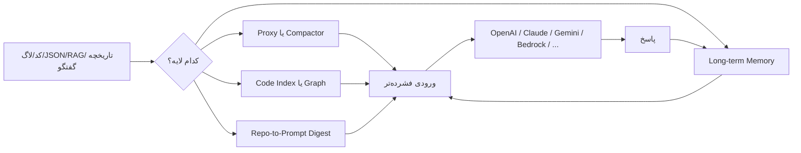
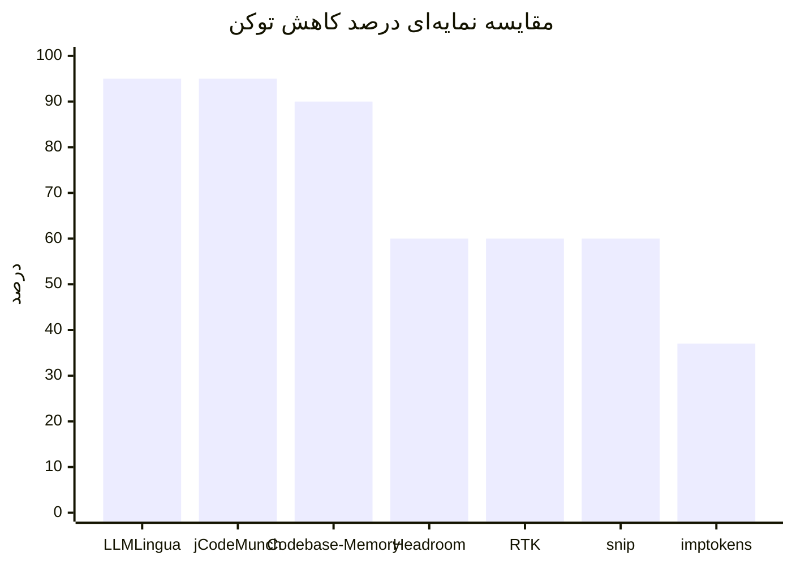

# فهرست به‌روز ابزارهای متن‌باز برای کاهش مصرف توکن و هزینه در کار با مدل‌های ابری

## خلاصه اجرایی

اگر هدف اصلی شما **کم‌کردن مستقیم قبض API** باشد، ابزارها عملاً به چهار خانواده تقسیم می‌شوند. خانواده اول، **proxy/compactor**ها هستند که قبل از رسیدن داده به مدل، خروجی‌های پرحجم، لاگ‌ها، JSON، diff و RAG chunkها را فشرده می‌کنند؛ در این دسته، **Headroom، RTK، snip، imptokens، Claw Compactor، Toonify MCP** و تا حدی **Token Optimizer** بیشترین اثر را دارند. خانواده دوم، **code graph / code intelligence**ها هستند که به‌جای فرستادن فایل‌به‌فایل به مدل، یک گراف یا ایندکس ساختاری می‌سازند و فقط پاسخ ساختاری لازم را برمی‌گردانند؛ در این دسته **codebase-memory-mcp، CodeGraph، Serena، jCodeMunch، code-review-graph، CodeGraphContext** مهم‌ترین‌ها هستند. خانواده سوم، **repo-to-prompt / repo digest**ها مثل **Repomix** و **Gitingest** هستند که الزاماً «فشرده‌ساز» نیستند، اما ورودی را prompt-friendly و اندازه‌پذیر می‌کنند. خانواده چهارم، **memory / long-term memory**ها مثل **Mem0، Graphiti، Cognee، projectmem، agentmemory، Engram** هستند که به‌جای حمل کل تاریخچه، حافظه قابل‌بازیابی می‌سازند و از این راه هزینه را کم می‌کنند. citeturn22view0turn22view1turn26view0turn23view0turn22view3turn22view4turn22view5turn27view0turn29view0turn31view2turn31view4turn31view5turn20view2turn18search4turn21search1turn12search0turn12search2turn12search3

از نظر **قدرت عددی کاهش توکن**، قوی‌ترین اعداد رسمیِ قابل‌اتکا در این مرور به این‌ها تعلق دارد: **LLMLingua** با «تا 20× فشرده‌سازی» در مقاله اصلی، **codebase-memory-mcp** با «10× توکن کمتر و 2.1× ابزار کمتر» روی 31 مخزن، **jCodeMunch** با «95%+» و بنچمارک متوسط 95% روی 15 تسک/3 مخزن، **Headroom** با ادعای 60–95%، **RTK** و **snip** با 60–90%، و **Mem0** با بیش از 90% صرفه‌جویی در token cost در مقاله‌اش. در مقابل، ابزارهایی مثل **Serena، Context7، Repomix، Gitingest، Cognee، Engram** معمولاً ارزششان بیشتر در «کاهش context غیرضروری» و «بهبود بازیابی» است تا یک درصد ساده و جهان‌شمولِ کاهش توکن. citeturn9search0turn10search3turn31view2turn24view0turn22view1turn26view0turn9search2turn29view0turn31view3turn31view4turn31view5turn21search1turn12search3

از نظر **بازده عملیاتی**، بهترین نتایج معمولاً از **ترکیب سه لایه** به‌دست می‌آید: یک shell/output compactor برای لاگ و تست، یک code graph برای حذف file-crawl، و یک memory layer برای حذف re-explaining بین سشن‌ها. اگر فقط یکی را بخواهید، انتخاب به workload بستگی دارد: برای **coding agentها روی ریپوی متوسط/بزرگ**، `codebase-memory-mcp` یا `CodeGraph` بیشترین ROI را دارند؛ برای **CLI-heavy workflows**، `RTK` یا `snip` سریع‌ترین نصب و سریع‌ترین برگشت سرمایه را می‌دهند؛ برای **RAG / prompt-heavy apps**، `Headroom` و `LLMLingua` گزینه‌های جدی‌ترند؛ و برای **cross-session agents**، `Mem0` یا `agentmemory` معمولاً از خلاصه‌سازی naïve مقرون‌به‌صرفه‌تر می‌شوند. citeturn28view3turn36view2turn25view2turn26view0turn24view2turn39search4turn9search2turn34view2

## نقشه مفهومی و روش ارزیابی

در این گزارش، «**سادگی راه‌اندازی**» را از 1 تا 5 این‌طور امتیاز داده‌ام: **5** یعنی نصب یک‌مرحله‌ای، بدون سرویس جانبی، و با دستورهای روشن؛ **3** یعنی نصب متوسط با چند prerequisite یا پیکربندی MCP/DB/SDK؛ **1** یعنی راه‌اندازی سنگین، چند سرویسه، یا نیازمند زیرساخت جداگانه. «**اثر**» هم از 1 تا 5 بر اساس ترکیب **بلوغ ابزار، وسعت پوشش، و شدت کاهش توکن/هزینه** داده شده است: **5** برای ابزارهایی با کاهش درشت یا مزیت ساختاری تکرارشونده، **3** برای بهبودهای معنادار ولی محدودتر، و **1** برای ابزارهای حاشیه‌ای یا صرفاً کمکی. هرجا عدد بنچمارک رسمی پیدا نشده، مقدار را دقیقاً `unspecified` گذاشته‌ام. citeturn24view1turn30view0turn37view3turn20view2

این نمودار عمداً ساده‌سازی شده است: در عمل، **proxyها** بیشتر روی token volume خام اثر می‌گذارند، **graph/index**ها روی حذف file-by-file exploration، و **memory layer**ها روی حذف تکرار context بین سشن‌ها. همین تفاوت دلیل اصلی این است که بعضی ابزارها روی «همه workloadها» عالی نیستند اما روی workload درست، اثر بسیار بیشتری از یک فشرده‌ساز عمومی می‌گذارند. citeturn22view0turn27view0turn31view0turn20view2turn18search4

## ابزارهای مستقیم فشرده‌سازی و پروکسی

جدول زیر ابزارهایی را پوشش می‌دهد که **به‌صورت مستقیم** حجم context ورودی به مدل را کم می‌کنند؛ یعنی قبل از ارسال به API یا قبل از ورود خروجی ابزارها به context window، یک مرحله فشرده‌سازی/فیلتر اعمال می‌کنند.

| پروژه | دسته | شرح کوتاه | پلتفرم‌ها / LLMهای هدف | کاهش توکن با منبع | سادگی راه‌اندازی | اثر | محدودیت‌ها و نکات امنیت/پرایوسی | repo / docs | آخرین release |
|---|---|---|---|---|---|---|---|---|---|
| **Headroom** | compression/proxy | کتابخانه + proxy + MCP؛ خروجی ابزار، لاگ، فایل، RAG chunk و history را قبل از رسیدن به LLM فشرده می‌کند. citeturn22view0turn24view2 | Anthropic، OpenAI، Bedrock، هر کلاینت OpenAI-compatible؛ Claude Code، Codex، Cursor، Aider، Copilot CLI، OpenClaw، OpenCode و… citeturn24view2turn24view3 | **60–95%** کمتر طبق README. citeturn24view0 | **4/5** — `pip install "headroom-ai[all]"` یا npm/docker؛ Python 3.10+؛ برای compression کامل ممکن است ONNX Runtime و مدل Hugging Face دانلود شود. citeturn24view1 | **5/5** | روی ماشین محلی اجرا می‌شود، اما برای بعضی قابلیت‌ها runtime asset از `cdn.pyke.io` و مدل از Hugging Face دریافت می‌شود؛ در محیط‌های corp/TLS سخت‌گیر باید تنظیمات CA/TLS را مدیریت کنید. citeturn24view1 | repo/docs در README. citeturn22view0 | **2026-06-22** (`0.27.0`). citeturn17search7 |
| **RTK** | shell-output compactor / proxy | proxy سطح shell برای بازنویسی و فیلتر خروجی دستورها؛ تمرکز روی workflowهای توسعه. citeturn22view1 | Claude Code، Copilot، Cursor، Gemini CLI، Codex، Windsurf، Cline، OpenCode، Hermes، Kiro، Antigravity و… citeturn25view2 | **60–90%** روی command outputهای رایج. citeturn22view1 | **5/5** — Homebrew / install script / Cargo / binary؛ تک‌باینری Rust، صفر dependency. citeturn25view3turn22view1 | **4/5** | روی Windows hook خودکار کامل ندارد و به حالت instruction fallback می‌رود؛ telemetry به‌صورت **opt-in** است و پیش‌فرض خاموش. citeturn25view2turn25view1 | repo/docs. citeturn22view1 | **2026-06-24** پیرامون نسخه `0.28.2` در README. citeturn25view2 |
| **snip** | shell-output compactor / proxy | فیلتر YAMLمحور برای shell output؛ ایده RTK را با موتور Go و DSL داده‌محور پیاده می‌کند. citeturn26view0 | Claude Code، Cursor، Copilot، Gemini CLI، Windsurf، Cline، Codex، Kilo Code، Antigravity، Aider و هر ابزار shell-based. citeturn26view0 | **60–90%** به‌صورت عمومی؛ نمونه رسمی: `go test` از 689 توکن به 16 توکن یعنی **97.7%** کمتر. citeturn26view0 | **5/5** — install script / Homebrew / `go install`؛ بعد `snip init`. citeturn26view0 | **4/5** | فیلترها YAML هستند و graceful degradation دارد، اما اگر ruleهای محلی خیلی aggressive شوند می‌توانند سیگنال مهم را حذف کنند؛ این ریسک ذاتی همه compactorهای rule-based است. citeturn26view0turn17search14 | repo/wiki docs. citeturn26view0 | **2026-06-22** (`v0.19.0`). citeturn26view0 |
| **imptokens** | compression library / local preprocessor | preprocessor عمومیِ متن قبل از هر LLM؛ دو موتور دارد: sentence mode بدون مدل و logprob mode با مدل محلی کوچک روی `llama.cpp`. citeturn23view0turn23view2 | Claude، GPT-4/5، Gemini، Ollama محلی، هر backend پشت LiteLLM. citeturn23view0 | sentence و logprob هر دو **30–70%** را هدف می‌گیرند؛ تنظیم پیش‌فرض پیشنهادی در benchmark: **37.2% کاهش توکن با 95% حفظ key-fact**. citeturn23view2 | **4/5** — CLI-first؛ sentence mode تقریباً zero-dependency، logprob mode دانلود ~700MB مدل محلی می‌خواهد. citeturn23view2 | **4/5** | کاملاً محلی اجرا می‌شود؛ برای mode اصلی باید مدل محلی داشته باشید و سرعت/کیفیت به سخت‌افزار وابسته است. مزیت بزرگش همین local-first بودن روی Apple Silicon/CUDA/Vulkan/CPU است. citeturn23view0turn23view2 | repo. citeturn22view2 | **2026-03-05** (`v0.1.0`). citeturn22view2 |
| **Claw Compactor** | compression engine / OpenCompress ecosystem | موتور deterministic چندمرحله‌ای برای فشرده‌سازی LLM context؛ تمرکز روی کد، JSON و routing محتوایی. citeturn22view3 | به‌صورت عمومی برای agent workspaceها؛ جزء هسته اکوسیستم OpenCompress/OpenClaw در منابع رسمی پیدا شد. citeturn22view3turn17search10 | README فعلی: **15–82%** بسته به نوع محتوا؛ متادیتای استنادی قدیمی‌تر حتی **50–97%** را ذکر کرده، بنابراین باید این اعداد را heterogeneous دانست. citeturn22view3turn17search9turn17search12 | **3/5** — ابزار Python با تست زیاد، ولی معماری و pipeline آن نسبت به RTK/snip پیچیده‌تر است. citeturn22view3turn17search12 | **3/5** | deterministic و «بدون هزینه inference مدل» تبلیغ می‌شود؛ با این حال بنچمارک‌هایش ناهمگن‌اند و باید قبل از production روی دیتای خودتان validate شود. citeturn22view3turn17search6 | repo/docs. citeturn22view3 | **2026-03-18** (`v7.0.0`)؛ metadata قدیمی‌تر `2026-03-09` برای `1.0.0` هم وجود دارد. citeturn17search6turn17search9 |
| **Toonify MCP** | context-compression plugin | پلاگین/سرور MCP برای Claude Code که JSON/CSV/YAML/log/stack trace/source file را قبل از ورود به context trim می‌کند. citeturn22view4 | Claude Code plugin یا MCP server on-demand. citeturn22view4 | READMEهای ترجمه‌شده پروژه **30–65%** کاهش استفاده از Claude API tokens را مطرح می‌کنند. citeturn8search14 | **4/5** — `npm install`, build و `toonify-mcp setup`; برای Claude Code plug-and-play است. citeturn8search18turn22view4 | **3/5** | scope آن بیشتر روی **tool output** است، نه روی کل معماری context. همچنین automatic background behavior ممکن است روی debugging بعضی edge caseها visibility را کم کند. citeturn22view4 | repo/site. citeturn22view4 | **unspecified** |
| **Token Optimizer** | multi-surface token optimizer | فقط output compressor نیست؛ روی 8 سطح اتلاف context کار می‌کند: command output، re-readها، configs، memory، compaction و model routing. citeturn22view5 | Claude Code، VS Code، Codex، OpenClaw، OpenCode، Hermes، Copilot؛ Cursor/Windsurf در roadmap. citeturn22view5 | target رسمی: **5–15%** context recovery؛ تا **25%+** با autocompact management. citeturn8search17 | **4/5** — plugin/installer محور؛ یک‌بار `/token-optimizer` اجرا می‌شود و بعد خودکار کار می‌کند. citeturn22view5 | **3/5** | مزیتش cache-safe و zero-telemetry بودن است، اما numbers آن به‌شدت workflow-dependent است و مثل RTK/headroom یک درصد جهان‌شمول مستقیم برای همه promptها نمی‌دهد. citeturn22view5 | repo/site. citeturn22view5 | **حداقل 2026-06** در releaseهای v5.x روی issue/repo دیده می‌شود؛ تاریخ دقیق latest در این مرور به‌صورت مستقیم freeze نشد. citeturn8search9turn8search13 |
| **LLMLingua** | research-grade prompt compression | فشرده‌سازی prompt با یک مدل کوچک برای حذف tokenهای کم‌اهمیت، قابل‌استفاده روی black-box LLMها. citeturn9search0turn14search10 | مستقل از provider؛ مناسب OpenAI/Anthropic/Gemini/Bedrock چون روی ورودی کار می‌کند. citeturn9search0 | مقاله اصلی: **تا 20× compression** با افت کم عملکرد. citeturn9search0 | **3/5** — بیشتر library/research artifact است تا ابزار plug-and-play برابر با RTK/snIP. citeturn39search4 | **4/5** | quality به task بستگی دارد؛ انتقال‌پذیری compression به معماری‌های غیر autoregressive هم یکنواخت نیست. citeturn9search8turn14search3 | repo/paper. citeturn39search4turn9search0 | **2024-04-09** (`v0.2.0` release surfaced). citeturn39search0turn39search8 |
| **LLMLingua-2** | research-grade prompt compression | نسخه task-agnostic با data distillation از GPT-4 و encoder سبک‌تر برای compression faithfulتر. citeturn9search1turn39search4 | مستقل از provider؛ paper روی LLMهای مختلف ارزیابی شده است. citeturn9search1 | **2× تا 5× compression**، **1.6× تا 2.9×** سرعت end-to-end، و **3× تا 6×** سریع‌تر از روش‌های قبلی. citeturn9search1 | **3/5** | **4/5** | هنوز library/research-first است و مثل هر prompt compressor نیازمند ارزیابی task-specific است. citeturn9search1turn14search3 | repo/paper. citeturn39search4turn9search1 | با همان repo LLMLingua منتشر می‌شود؛ release جداگانه واضحی در منابع رسمی این مرور پیدا نشد. citeturn39search4turn39search0 |

این نمودار **مقایسه‌ی نرمال‌سازی‌شده و محافظه‌کارانه** است، نه benchmark برابر-با-برابر. برای ابزارهای بازه‌ای، کمینه یا عدد canonical‌تر را گذاشته‌ام؛ برای مثال LLMLingua از 20× به‌صورت تقریبی معادل 95% reduction در نظر گرفته شده، codebase-memory از 10× کمتر شدن توکن معادل 90%، و imptokens از تنظیم پیشنهادی رسمی 37.2% استفاده شده است. citeturn9search0turn31view2turn10search3turn24view0turn22view1turn26view0turn23view2

## ابزارهای codebase index و repo-to-prompt

این گروه معمولاً وقتی بیشترین ارزش را دارد که عامل هوشمند شما روی **مخزن‌های واقعی، چندفایلی، و پر از dependency** کار می‌کند. اینجا مسئله اصلی «فشرده‌کردن متن» نیست، بلکه **جلوگیری از exploration پرهزینه** است.

| پروژه | دسته | شرح کوتاه | پلتفرم‌ها / LLMهای هدف | کاهش توکن با منبع | سادگی راه‌اندازی | اثر | محدودیت‌ها و نکات امنیت/پرایوسی | repo / docs | آخرین release |
|---|---|---|---|---|---|---|---|---|---|
| **codebase-memory-mcp** | codebase index/graph | knowledge graph پایدار مبتنی بر Tree-sitter + MCP؛ پرسش‌های ساختاری را بدون file-crawl پاسخ می‌دهد. citeturn27view0turn28view3 | Claude Code، Codex CLI، Gemini CLI، Zed، OpenCode، Antigravity، Aider، KiloCode، VS Code، OpenClaw، Kiro و هر MCP client. citeturn28view3turn27view0 | paper: **10× توکن کمتر** و **2.1× ابزار کمتر** روی 31 repo؛ headline repo حتی **99% fewer tokens** را هم بازاریابی می‌کند، ولی عدد paper اتکاپذیرتر است. citeturn10search3turn27view0 | **5/5** — single static binary، zero dependencies، install script و حتی npm/pip/go distribution. citeturn27view0turn27view1 | **5/5** | data کاملاً local می‌ماند؛ امنیت supply-chain نسبتاً خوب مستندسازی شده: checksums، Sigstore، SLSA، VirusTotal scan. citeturn27view0turn28view1 | repo/site/paper. citeturn27view0turn10search7turn10search3 | **2026-06-12** (`v0.8.1`). citeturn28view1 |
| **CodeGraph** | codebase index/graph | گراف دانش کد local-first با auto-sync و MCP؛ agent را از `grep/read` پی‌درپی خلاص می‌کند. citeturn32view0turn36view2 | Claude Code، Cursor، Codex CLI، OpenCode، Hermes Agent، Gemini CLI، Antigravity، Kiro. citeturn32view0turn32view2 | benchmark رسمی روی 7 repo: **58% ابزار کمتر**، **22% سریع‌تر**، و بسته به repo **23% تا 64% توکن کمتر**. citeturn36view2turn36view3 | **4/5** — `npx @colbymchenry/codegraph` و بعد `codegraph init`. citeturn32view2 | **5/5** | 100% local و بدون API key؛ اما payoff مالی روی مخزن‌های کوچک کمتر از payoff سرعت/precision است. citeturn32view0turn36view3 | repo/docs. citeturn31view0 | **2026-06-24** (`v1.1.1`). citeturn32view0 |
| **Serena** | codebase index/semantic IDE tools | semantic retrieval/edit/refactor/debugging در سطح symbol؛ از LSP یا JetBrains backend استفاده می‌کند. citeturn29view0 | هر MCP client/LLM؛ Claude Code، Codex، OpenCode، Gemini CLI، VS Code/Cursor/JetBrains assistants و… citeturn29view0 | **unspecified**؛ خود پروژه بیشتر روی «semantic precision» و «ابزار IDE-level» تأکید دارد تا درصد reduction. citeturn29view0 | **4/5** — فقط `uv` prerequisite دارد؛ `uv tool install -p 3.13 serena-agent` و `serena init`. برای بعضی زبان‌ها ممکن است LSPهای اضافه لازم شوند. citeturn30view0turn30view1 | **4/5** | versionهای marketplace را خود پروژه توصیه نمی‌کند؛ backend زبان‌-سرور یا JetBrains plugin dependency اضافه ایجاد می‌کند. citeturn30view1 | repo/docs. citeturn29view0 | **2026-05-26** (`v1.5.3`). citeturn19view3 |
| **jCodeMunch MCP** | codebase index/graph | retrieval نمادمحور برای کد GitHub via tree-sitter AST. citeturn31view2 | Claude Code، Cursor و هر MCP client؛ عمدتاً روی GitHub source retrieval. citeturn31view2 | benchmark رسمی repo: **95% average token reduction** روی 15 task / 3 repo، با **99.8% peak**. citeturn31view2 | **4/5** — package/releaseهای آماده دارد، ولی نسبت به ابزار local graph-only کمی GitHub-centricتر است. citeturn11search11turn11search7 | **4/5** | چون retrieval آن GitHubمحور است، برای repoهای کاملاً local یا air-gapped مزیتش کمتر از graphهای local-first است. citeturn31view2 | repo/site. citeturn31view2 | **2026-06-24** (`v1.108.82`). citeturn19view2 |
| **code-review-graph** | codebase index/graph | persistent map برای review/workflowهای large-repo؛ blast radius و minimal review context می‌سازد. citeturn31view1turn33view3 | Codex، Claude Code، Cursor، Windsurf، Zed، Continue، OpenCode، Antigravity، Gemini CLI، Qwen، Qoder، Kiro، Copilot و Copilot CLI. citeturn33view3 | benchmarkهای رسمی دارد ولی یک درصدِ واحدِ headline در snippetهای بازیابی‌شده روشن نبود؛ **unspecified**. citeturn33view3turn33view0 | **4/5** — `pip install code-review-graph && code-review-graph install`؛ Python 3.10+، و build اولیه ~10s برای 500 فایل. citeturn33view3 | **4/5** | local-first است، اما در تغییرهای خیلی کوچک، graph context می‌تواند از naïve file read بزرگ‌تر شود؛ خود README این trade-off را شفاف گفته است. citeturn33view3 | repo/site. citeturn31view1 | **2026-06-10** (`v2.3.6`). citeturn33view0 |
| **CodeGraphContext** | codebase index/graph | MCP server + CLI که کد محلی را در graph DB ایندکس می‌کند و graph visualization هم می‌دهد. citeturn11search0turn11search17 | MCP-compatible assistants. citeturn11search0 | **unspecified** | **3/5** — Python 3.10+؛ graph DB و visualization آن نسبت به codebase-memory/codegraph کمی سنگین‌تر به نظر می‌رسد. citeturn11search17turn38search5 | **3/5** | مزیت اصلی exploration بصری و graph querying است؛ benchmark headline در منبع رسمی بازیابی‌شده مشخص نبود. citeturn11search0turn38search5 | repo/docs. citeturn11search0 | **unspecified** |
| **Context7** | doc/index retrieval | به‌جای کد پروژه، documentation به‌روز کتابخانه‌ها را برای AI editorها فراهم می‌کند؛ هدف اصلی کاهش hallucination و بار context دستی است. citeturn31view3 | AI code editors و MCP clients. citeturn31view3 | **unspecified** | **4/5** — MCP server آماده دارد؛ releaseهای frequent. citeturn31view3turn38search4 | **3/5** | عدد reduction رسمی ندیدم؛ ارزشش بیشتر در **fresh docs retrieval** است تا فشرده‌سازی مستقیم. همچنین مسائل auth/private endpointها هنوز active issue دارند. citeturn31view3turn38search13 | repo/site. citeturn31view3 | **2026-06-22** (`3.2.2`). citeturn31view3 |
| **Repomix** | repo-to-prompt | کل repo را در یک فایل AI-friendly pack می‌کند، token count هم می‌دهد و `--token-budget` دارد. citeturn31view4turn38search0 | Claude، ChatGPT، DeepSeek، Perplexity، Gemini، Gemma، Llama، Grok و… citeturn31view4 | **unspecified**؛ بیشتر optimizerِ بسته‌بندی و budget guard است تا compressor. citeturn31view4turn38search0 | **5/5** — one-command CLI و browser UI. citeturn31view4turn38search0 | **3/5** | اگر بی‌فیلتر کل repo را pack کنید، هنوز ممکن است context بزرگ شود؛ مزیت اصلی‌اش نظم، ignore-awareness و token visibility است. citeturn31view4 | repo/site. citeturn31view4 | **latest surfaced: v1.15.0**. citeturn38search0 |
| **Gitingest** | repo-to-prompt | digest متنی prompt-friendly از repo از روی URL یا دایرکتوری می‌سازد و token count گزارش می‌کند. citeturn31view5turn37view2 | هر LLM/workflow که ingest متنی بخواهد. citeturn31view5 | **unspecified** | **5/5** — `pip install gitingest` یا `pipx install gitingest`؛ Python 3.8+. citeturn37view3 | **2/5** | برای private repo به GitHub PAT نیاز دارد؛ این ابزار context را قابل‌مصرف‌تر می‌کند ولی ذاتاً graph/memory/proxy نیست. citeturn37view3 | repo/site. citeturn31view5 | **2025-07-31** (`v0.3.1`). citeturn18search2 |

تحلیل این جدول روشن است: **برای repoهای بزرگ، code graphها اغلب از prompt compressorهای صرف مؤثرترند**، چون اصلاً مانع تولید context بیهوده می‌شوند. همین‌جا تفاوت `codebase-memory-mcp` و `CodeGraph` با `Repomix/Gitingest` دیده می‌شود: دو ابزار اول «مسئله discovery» را حل می‌کنند؛ دو ابزار آخر فقط «بسته‌بندی» را بهتر می‌کنند. بنابراین اگر عامل شما زیاد `grep → read → grep → read` می‌کند، رفتن به سمت graph تقریباً همیشه اثر بیشتری از صرفاً compact‌کردن output دارد. citeturn10search3turn36view2turn31view4turn31view5

## لایه‌های memory و ابزارهای رسمی و پژوهشی

ابزارهای حافظه بلندمدت، reduction را از مسیر دیگری می‌آورند: شما به‌جای paste کردن history یا خلاصه‌سازی دستی هر session، فقط **memoryهای مرتبط را search/retrieve** می‌کنید. در عمل، این لایه‌ها برای agentهای طولانی‌عمر از compactorهای صرف مهم‌تر می‌شوند.

| پروژه / ابزار | دسته | شرح کوتاه | پلتفرم‌ها / LLMهای هدف | کاهش توکن / هزینه با منبع | سادگی راه‌اندازی | اثر | محدودیت‌ها و نکات امنیت/پرایوسی | repo / docs | آخرین release |
|---|---|---|---|---|---|---|---|---|---|
| **Mem0** | memory/long-term | memory layer عمومی برای agentها و assistantها؛ library، CLI، self-hosted server و platform دارد. citeturn20view2turn20view3 | OpenAI پیش‌فرض است ولی LLMها و embeddingهای متنوع را پشتیبانی می‌کند؛ همچنین skills/plugins برای Claude Code، Codex، Cursor، OpenCode، OpenClaw و… دارد. citeturn20view2turn20view3 | paper: **91% lower p95 latency** و **90%+ token cost savings**؛ repo bench جدید هم LongMemEval/LoCoMo را با حدود 6.8–7.0K token نشان می‌دهد. citeturn9search2turn20view3 | **3/5** — library ساده است، ولی self-hosted جدی نیازمند server/bootstrap/auth و provider config است. citeturn20view2 | **5/5** | اگر cloud/platform استفاده کنید، data residency و retention باید جداگانه بررسی شود؛ self-hosted auth هم به‌صورت پیش‌فرض فعال است. release feed اصلی repo هم کمی plugin-centric شده است. citeturn20view2turn19view1turn18search15 | repo/docs/paper. citeturn20view2turn9search2 | **2026-06-17** در صفحه release اصلی، latest ورودی plugin دیده می‌شود؛ برای core server tagging وضعیت یکدست نیست. citeturn19view1turn18search15 |
| **Graphiti** | memory/temporal graph | temporal knowledge graph برای agent memory؛ facts را همراه زمان و provenance نگه می‌دارد. citeturn18search4turn9search13 | framework برای agentها؛ graph backends متعدد. citeturn18search4turn18search8 | paper: **تا 18.5% بهبود accuracy** و **90% کاهش latency** نسبت به baselineها؛ درصد token reduction صریح در snippetهای بررسی‌شده **unspecified** است. citeturn9search3turn9search6 | **2/5** — معمولاً نیازمند graph DB و ingestion pipeline است. citeturn18search8 | **3/5** | برای production باید backend graph و accuracy/retrieval کیفیت‌سنجی شود؛ issueهای active درباره schema/config هم وجود دارد. citeturn18search8turn18search16 | repo/paper. citeturn18search4turn9search3 | **2026-06-08** (`v0.29.2`). citeturn18search8turn39search6 |
| **Cognee** | memory/long-term | AI memory platform مبتنی بر knowledge graph + vector reasoning. citeturn12search5 | self-hosted knowledge graph engine و MCP/docker modes. citeturn12search5turn12search9 | **unspecified** | **2/5** — docker/env-file/MCP/config؛ برای production از Mem0 سنگین‌تر به نظر می‌رسد. citeturn12search9turn21search1 | **3/5** | memory platform کامل است، ولی benchmark token-centric شفاف در snippetهای رسمی بازیابی‌شده نداشت؛ چند issue درباره usability و سازگاری هم دیده می‌شود. citeturn21search19turn12search18 | repo/release. citeturn21search1turn39search3 | **2026-06-21** (`v1.2.1`). citeturn39search3turn39search7 |
| **projectmem** | memory/long-term | local-first, event-sourced memory/judgment layer برای AI coding agents. citeturn12search0 | ابزارهای coding agent محلی؛ بر local/no-cloud بودن تأکید دارد. citeturn12search12 | paper/repo: در MCP mode حدود **800–1,500 توکن** بارگیری می‌کند، در حالی‌که بدون memory layer حدود **5,000–20,000 توکن** برای بازسازی context هر session تخمین زده شده است. citeturn10search15 | **4/5** — tutorial 15 دقیقه‌ای و تمرکز local-first. citeturn21search0turn12search12 | **4/5** | local-first بودن مزیت privacy است، اما اکوسیستم و integration breadth آن هنوز کوچکتر از Mem0 است. citeturn12search12turn21search0 | repo/paper. citeturn12search0turn10search15 | **latest surfaced: v0.1.4**. citeturn21search0 |
| **agentmemory** | memory/long-term | persistent memory برای AI coding agents؛ memoryها را بین sessionها inject/search می‌کند. citeturn12search2turn34view2 | Claude Code، Copilot CLI، Cursor، Gemini CLI، Codex CLI، Hermes، OpenClaw، OpenCode و هر MCP/HTTP agent. citeturn12search2turn34view2 | scorecard repo: در LongMemEval-S، **R@5=95.2%**؛ مدل cost آن نشان می‌دهد `~170K tokens/yr` در برابر `~650K` برای LLM-summarized memory و `19.5M+` برای paste-full-context. این یعنی تقریباً **74% کمتر** از summarized baseline و **>99% کمتر** از full-context baseline، البته این بخش یک **استنتاج از جدول خود پروژه** است. citeturn34view2 | **4/5** — `npx @agentmemory/agentmemory` و سرور واحد؛ benchmark harness هم open است. citeturn34view2turn34view0 | **4/5** | چون memory پایدار می‌سازد، hygiene و scope isolation مهم است؛ خود release notes پروژه هم به security fix در agent-scope اشاره کرده‌اند. citeturn21search17turn21search6 | repo/docs. citeturn12search2turn34view2 | **2026-06-07** (`0.9.27`). citeturn21search17 |
| **Engram** | memory/long-term | persistent shared memory infrastructure برای coding agents. citeturn12search3 | coding agents؛ daemon/binary install. citeturn21search3 | **unspecified** | **4/5** — binary install پایدار برای Linux/macOS در README دیده می‌شود. citeturn21search3 | **3/5** | benchmark token-centric رسمی در snippetها دیده نشد؛ ارزش آن بیشتر در shared persistent memory است. citeturn12search3 | repo. citeturn12search3 | **unspecified**؛ README به «Binary Installation (v4+)» اشاره می‌کند. citeturn21search3 |
| **OpenAI Prompt Caching** | official best-practice/tool | cache خودکار prefixهای تکراری؛ برای repeated system prompts / tools / history بسیار مؤثر است. citeturn40search0turn40search2 | OpenAI API روی مدل‌های جدید. citeturn40search0 | **تا 80% latency کمتر** و **تا 90% input cost کمتر**؛ pricing page هم cached input را عموماً بسیار ارزان‌تر نشان می‌دهد. citeturn40search0turn40search1 | **5/5** — خودکار و بدون تغییر کد. citeturn40search0 | **5/5** | در داده‌های OpenAI، extended prompt caching شامل نگه‌داری state رمزنگاری‌شده روی GPU-local storage تا سقف 24 ساعت می‌شود؛ برای `store="false"` retention سمت سرور برای compaction صفر است. citeturn40search6 | docs. citeturn40search0turn40search1 | رسمی و جاری؛ release-style version ندارد. |
| **Anthropic Prompt Caching / Claude Code cost features** | official best-practice/tool | prompt caching و auto-compaction برای کاهش هزینه در Claude API/Claude Code. citeturn41search0turn41search2 | Claude API و Claude Code. citeturn41search0turn41search2 | release notes و docs: **تا 80% latency کمتر** و **تا 90% cost کمتر**؛ cached input tokens برای مدل‌های واجد شرایط با **10% قیمت input base** حساب می‌شوند و به rate limit هم شمرده نمی‌شوند. citeturn41search5turn41search13 | **5/5** — automatic caching یا top-level `cache_control`. citeturn41search0 | **5/5** | Claude Code خودش auto-compaction و prompt caching دارد؛ اما مثل هر caching provider-side باید data policy مدل/plan شما بررسی شود. در docs Anthropic این قابلیت با ZDR هم سازگار توصیف شده است. citeturn41search2turn41search15 | docs. citeturn41search0turn41search2 | رسمی و جاری؛ release-style version ندارد. |
| **tiktoken / Ollama tokenize / llama.cpp count_tokens** | tokenizer / optimizer utilities | این‌ها compressor نیستند، ولی برای **budgeting، splitting، validation و preflight token counting** حیاتی‌اند. `tiktoken` tokenizer سریع OpenAI است؛ Ollama endpointهای tokenize/detokenize دارد؛ `llama.cpp` هم endpoint رسمی `count_tokens` دارد. citeturn13search7turn13search10turn13search14 | OpenAI-token budgeting، Ollama local stacks، llama.cpp local stacks. citeturn13search7turn13search10turn13search14 | **unspecified** برای کاهش مستقیم؛ اما `tiktoken` از نظر performance **3–6×** سریع‌تر از tokenizer متن‌باز comparable گزارش شده است. citeturn13search7 | **5/5** | **2/5** | این ابزارها به‌تنهایی توکن را کم نمی‌کنند؛ فقط measurement و guardrail می‌دهند. برای pipelineهای Ollama/llama.cpp، همین اندازه‌گیری دقیق معمولاً پیش‌نیاز کمپرسورهای محلی است. citeturn13search10turn13search14 | repos/docs. citeturn13search7turn13search14 | Ollama tokenize endpoints از 2025-08 pull request رسمی surfaced شد؛ `llama.cpp` docs جاری‌اند. citeturn13search10turn13search14 |
| **ReLM** | adjacent research | مستقیماً prompt compressor نیست؛ برای validation/querying/control با regular expressions روی LLMهاست و efficiency ارزیابی را بالا می‌برد. citeturn15search2 | research/system-level. citeturn15search2 | **تا 15× system efficiency** و **2.5× data efficiency** در evaluation pipelineها. citeturn15search2 | **2/5** | **2/5** | چون هدف اصلی‌اش کاهش هزینه inference کاربردی نیست، آن را در دسته «adjacent» نگه داشته‌ام، نه core token-saving stack. citeturn15search2 | paper. citeturn15search2 | مقاله اصلی 2022 است. citeturn15search2 |

در این بخش یک نکته مهم هست: **provider-side caching تقریباً همیشه باید با tool-side compression ترکیب شود**. OpenAI و Anthropic وقتی prefix ثابت، system prompt، tool definitions یا history تکراری دارید بسیار قوی‌اند؛ اما اگر قبل از آن، agent شما هر بار 2MB تست لاگ و 20 فایل نامرتبط را هم بفرستد، cache فقط بخشی از مسئله را حل می‌کند. برعکس، اگر با `RTK/snip/Headroom` یا یک graph/index، نویز را اول کم کنید و بعد prompt caching provider را هم فعال نگه دارید، اثر تجمعی بسیار بالاتر می‌شود. citeturn40search0turn41search13turn25view2turn26view0turn24view2turn36view2

## جمع‌بندی تحلیلی و محدودیت‌ها

برای **بیشترین بازده عملی**، پیشنهاد معماری به این صورت است:

اگر workflow شما **CLI-heavy coding** است، stack ساده و بسیار پربازده این است: **RTK یا snip** برای shell output، به‌علاوه **CodeGraph** یا **codebase-memory-mcp** برای semantic/code-graph context. این ترکیب هم discovery cost را کم می‌کند و هم output noise را. برای repoهای بزرگ یا monorepoها، این دسته از ابزارها معمولاً از هر prompt compressor عمومی مؤثرترند، چون مشکل را در منبع حل می‌کنند. citeturn25view2turn26view0turn36view2turn10search3

اگر workload شما **generic RAG / application prompts / long documents** است، stack بهتر غالباً **Headroom** یا **LLMLingua/LLMLingua-2** به‌همراه **OpenAI/Anthropic prompt caching** است. `Headroom` برای integration breadth و reversible compression جذاب است، و `LLMLingua` هنوز قوی‌ترین reference research برای prompt compression cloud-agnostic باقی مانده است. citeturn24view3turn9search0turn9search1turn40search0turn41search0

اگر مشکل شما **فراموشی بین سشن‌ها** است، صرف compact کردن prompt کافی نیست؛ باید به لایه memory بروید. اینجا **Mem0** از نظر عددهای رسمی و maturity جلوتر است، **agentmemory** برای coding-agent stacks بسیار عمل‌گراست، و **projectmem** گزینه local-first تمیز و کم‌هزینه‌تری است. **Graphiti** و **Cognee** زمانی مناسب‌تر می‌شوند که graph memory واقعی و temporal provenance برای شما مهم باشد، نه فقط token efficiency خام. citeturn9search2turn34view2turn10search15turn9search3turn21search1

در مورد **Ollama/llama.cpp**، مهم‌ترین یافته این مرور این است که هنوز «اکوسیستم عظیمِ بالغِ compressor plugin» به اندازه Claude Code/OpenAI stacks شکل نگرفته، اما سه مسیر عملی وجود دارد: **imptokens** که مستقیماً روی `llama.cpp` و سخت‌افزار محلی اجرا می‌شود؛ **Ollama tokenization endpoints** برای budget guardها و cut-off دقیق؛ و **llama.cpp count_tokens** برای preflight checking. بنابراین اگر stack شما local-first است اما inference اصلی را روی cloud provider می‌زنید، بهترین معماری فعلاً معمولاً **local preprocessor + cloud API** است، نه صرفاً یک plugin اختصاصی Ollama. citeturn23view0turn23view2turn13search10turn13search14

از نظر **محدودیت‌های این مرور**، سه نکته را باید صریح گفت. اول، همه پروژه‌ها benchmark قابل‌بازتولید و هم‌مقیاس ندارند؛ برای چند پروژه، مخصوصاً **Context7، Repomix، Gitingest، Engram، Cognee، CodeGraphContext**، داده benchmark کاهش توکن در snippetهای رسمی بازیابی‌شده یا وجود نداشت یا برای قیاس عادلانه کافی نبود، و به همین دلیل `unspecified` ثبت شد. دوم، برای بعضی پروژه‌های پرشتاب، **release metadata** یکنواخت نبود؛ نمونه روشن آن feed اصلی **Mem0** است که latest entry در صفحه release بیشتر plugin-centric دیده می‌شود. سوم، در این پاس منبع‌محور، برای **Google Gemini** و **AWS Bedrock** به‌اندازه OpenAI/Anthropic، مواد رسمی با همان کیفیت و جزئیات در dataset فعلی بازیابی نشد؛ بنابراین آن‌ها را در تحلیل نهایی به‌صورت کمی و رتبه‌بندی‌شده نیاوردم، نه به این دلیل که قابلیت‌های مرتبط ندارند، بلکه به این دلیل که نمی‌خواستم بدون منبع هم‌سطح، قیاس عددی ارائه کنم. citeturn31view3turn31view4turn31view5turn12search3turn21search1turn11search0turn19view1

اگر بخواهم یک نسخه خیلی فشرده بدهم: **برای coding agents بزرگ‌مقیاس، `codebase-memory-mcp` و `CodeGraph` بالاترین اثر ساختاری را دارند؛ برای output-heavy workflows، `RTK` و `snip` سریع‌ترین برد هستند؛ برای prompt-heavy appها، `Headroom` و `LLMLingua` مهم‌ترین نام‌ها هستند؛ و برای sessionهای طولانی، `Mem0` و `agentmemory` بیشترین صرفه‌جویی مرکب را می‌سازند.** citeturn10search3turn36view2turn25view2turn26view0turn24view0turn9search0turn9search2turn34view2